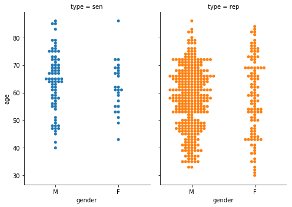
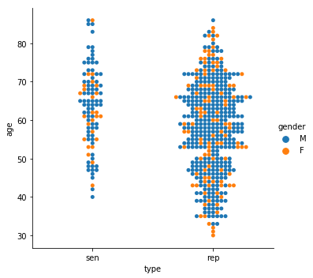
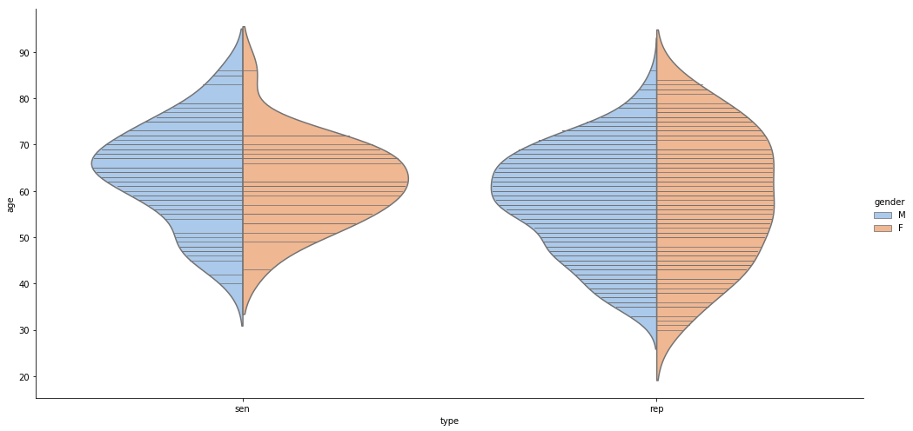
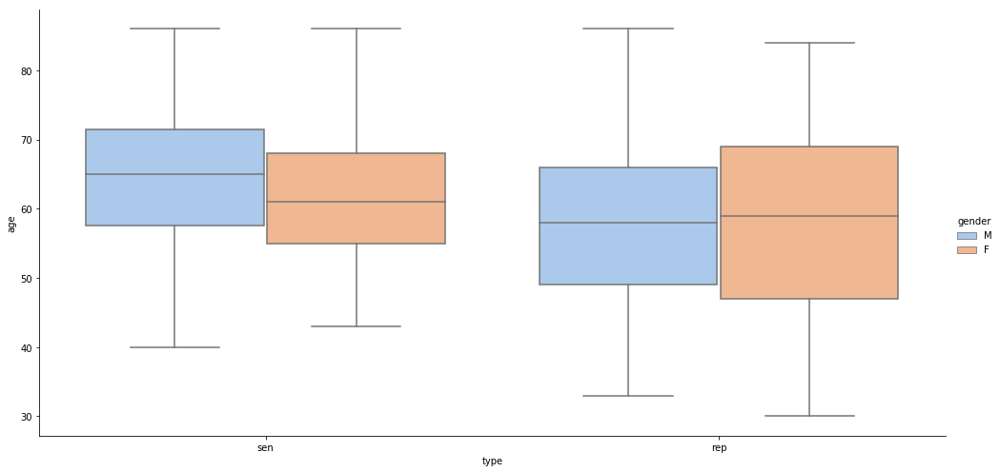
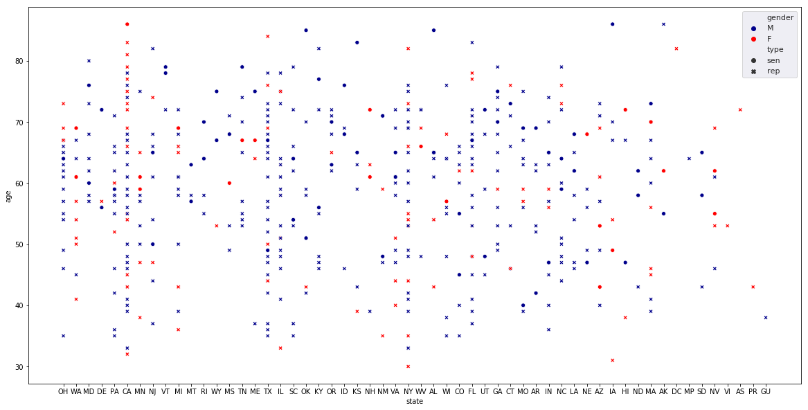

# Instructions
## Please read carefully

### Starting Your Notebook

This is a template notebook to get you started with the data visualization impact project. __Please do not edit this notebook directly.__ Take the following steps to begin:


1.   Save a copy of this notebook - File > Save a copy in Drive
2.   Rename the copy - remove "Copy of" from the name, and replace "template" with your name (e.g., us_legislators_sam.ipynb)
3.   Move the notebook to our project folder in the Girls Who Code Josephinum shared Drive ([data_viz_impact_project/notebooks](https://drive.google.com/drive/u/0/folders/1Y1MhbAtWkHbN_GHCvroDRNb4-AWs4stR)). Within this notebook, you can go to File > Locate in Drive if you're not sure where the notebook is located, or navigate to the Colab Notebooks folder in your Google Drive.

# US Legislators Data
__Source:__ https://github.com/unitedstates/congress-legislators
<br>
<br>

This data comes from [@unitedstates project](https://theunitedstates.io/), which is a shared commons of data and tools for the United States. Made by the public, used by the public. We will work with the legislators-current dataset that has currently serving members of Congress and information about the state they represent, their political party, gender, birthdate, whether they are in the Senate or House of Representatives, and other information.

There are additional datasets containing members of the United States Congress (1789-Present), congressional committees (1973-Present), committee membership (current only), and presidents and vice presidents of the United States. Not all of the datasets are in .csv files, so if you want to work with others, you will have to figure out how to use YAML or JSON (not too difficult with some searching!).

__Be careful__ because there is some missing information that shows up as `NaN` in the data, and there is some messy text and dates you may need to parse.

## Boilerplate code


1.   Import Python libraries and update Seaborn if needed
2.   Read in datasets
3.   Quickly examine a few rows of data


```
import pandas as pd
import numpy as np
import seaborn as sns
from matplotlib import pyplot
```


```
import seaborn as sns
# Check seaborn version - Make sure you restart runtime if seaborn updates!
sns_version = (sns .__version__)
if sns_version == "0.9.0":
  print("You are good to go!")
else:
  !pip install seaborn --upgrade
  print("\n \n Seaborn was updated. Please restart the notebook by going to Runtime > Restart runtime before running any further code.")
```

    You are good to go!


We can read the data directly from the @unitedstates project website [here](https://theunitedstates.io/congress-legislators/legislators-current.csv). But see the [github project page](https://github.com/unitedstates/congress-legislators) for additional data details.


```
legislators = pd.read_csv("https://theunitedstates.io/congress-legislators/legislators-current.csv")
```


```
#Data in speadsheet format
legislators.head(6)
```


<div>
<style scoped>
    .dataframe tbody tr th:only-of-type {
        vertical-align: middle;
    }

    .dataframe tbody tr th {
        vertical-align: top;
    }

    .dataframe thead th {
        text-align: right;
    }
</style>
<table border="1" class="dataframe">
  <thead>
    <tr style="text-align: right;">
      <th></th>
      <th>last_name</th>
      <th>first_name</th>
      <th>middle_name</th>
      <th>suffix</th>
      <th>nickname</th>
      <th>full_name</th>
      <th>birthday</th>
      <th>gender</th>
      <th>type</th>
      <th>state</th>
      <th>district</th>
      <th>senate_class</th>
      <th>party</th>
      <th>url</th>
      <th>address</th>
      <th>phone</th>
      <th>contact_form</th>
      <th>rss_url</th>
      <th>twitter</th>
      <th>facebook</th>
      <th>youtube</th>
      <th>youtube_id</th>
      <th>bioguide_id</th>
      <th>thomas_id</th>
      <th>opensecrets_id</th>
      <th>lis_id</th>
      <th>fec_ids</th>
      <th>cspan_id</th>
      <th>govtrack_id</th>
      <th>votesmart_id</th>
      <th>ballotpedia_id</th>
      <th>washington_post_id</th>
      <th>icpsr_id</th>
      <th>wikipedia_id</th>
    </tr>
  </thead>
  <tbody>
    <tr>
      <th>0</th>
      <td>Brown</td>
      <td>Sherrod</td>
      <td>NaN</td>
      <td>NaN</td>
      <td>NaN</td>
      <td>Sherrod Brown</td>
      <td>1952-11-09</td>
      <td>M</td>
      <td>sen</td>
      <td>OH</td>
      <td>NaN</td>
      <td>1.0</td>
      <td>Democrat</td>
      <td>https://www.brown.senate.gov</td>
      <td>503 Hart Senate Office Building Washington DC ...</td>
      <td>202-224-2315</td>
      <td>http://www.brown.senate.gov/contact/</td>
      <td>http://www.brown.senate.gov/rss/feeds/?type=al...</td>
      <td>SenSherrodBrown</td>
      <td>SenatorSherrodBrown</td>
      <td>SherrodBrownOhio</td>
      <td>UCgy8jfERh-t_ixkKKoCmglQ</td>
      <td>B000944</td>
      <td>136.0</td>
      <td>N00003535</td>
      <td>S307</td>
      <td>H2OH13033,S6OH00163</td>
      <td>5051.0</td>
      <td>400050</td>
      <td>27018.0</td>
      <td>Sherrod Brown</td>
      <td>NaN</td>
      <td>29389.0</td>
      <td>Sherrod Brown</td>
    </tr>
    <tr>
      <th>1</th>
      <td>Cantwell</td>
      <td>Maria</td>
      <td>NaN</td>
      <td>NaN</td>
      <td>NaN</td>
      <td>Maria Cantwell</td>
      <td>1958-10-13</td>
      <td>F</td>
      <td>sen</td>
      <td>WA</td>
      <td>NaN</td>
      <td>1.0</td>
      <td>Democrat</td>
      <td>https://www.cantwell.senate.gov</td>
      <td>511 Hart Senate Office Building Washington DC ...</td>
      <td>202-224-3441</td>
      <td>http://www.cantwell.senate.gov/public/index.cf...</td>
      <td>http://www.cantwell.senate.gov/public/index.cf...</td>
      <td>SenatorCantwell</td>
      <td>senatorcantwell</td>
      <td>SenatorCantwell</td>
      <td>UCN52UDqKgvHRk39ncySrIMw</td>
      <td>C000127</td>
      <td>172.0</td>
      <td>N00007836</td>
      <td>S275</td>
      <td>S8WA00194,H2WA01054</td>
      <td>26137.0</td>
      <td>300018</td>
      <td>27122.0</td>
      <td>Maria Cantwell</td>
      <td>NaN</td>
      <td>39310.0</td>
      <td>Maria Cantwell</td>
    </tr>
    <tr>
      <th>2</th>
      <td>Cardin</td>
      <td>Benjamin</td>
      <td>L.</td>
      <td>NaN</td>
      <td>NaN</td>
      <td>Benjamin L. Cardin</td>
      <td>1943-10-05</td>
      <td>M</td>
      <td>sen</td>
      <td>MD</td>
      <td>NaN</td>
      <td>1.0</td>
      <td>Democrat</td>
      <td>https://www.cardin.senate.gov</td>
      <td>509 Hart Senate Office Building Washington DC ...</td>
      <td>202-224-4524</td>
      <td>http://www.cardin.senate.gov/contact/</td>
      <td>http://www.cardin.senate.gov/rss/feeds/?type=all</td>
      <td>SenatorCardin</td>
      <td>senatorbencardin</td>
      <td>senatorcardin</td>
      <td>UCiQaJnMzlfzzG3VESgyZChA</td>
      <td>C000141</td>
      <td>174.0</td>
      <td>N00001955</td>
      <td>S308</td>
      <td>H6MD03177,S6MD03177</td>
      <td>4004.0</td>
      <td>400064</td>
      <td>26888.0</td>
      <td>Ben Cardin</td>
      <td>NaN</td>
      <td>15408.0</td>
      <td>Ben Cardin</td>
    </tr>
    <tr>
      <th>3</th>
      <td>Carper</td>
      <td>Thomas</td>
      <td>Richard</td>
      <td>NaN</td>
      <td>NaN</td>
      <td>Thomas R. Carper</td>
      <td>1947-01-23</td>
      <td>M</td>
      <td>sen</td>
      <td>DE</td>
      <td>NaN</td>
      <td>1.0</td>
      <td>Democrat</td>
      <td>https://www.carper.senate.gov/public</td>
      <td>513 Hart Senate Office Building Washington DC ...</td>
      <td>202-224-2441</td>
      <td>http://www.carper.senate.gov/public/index.cfm/...</td>
      <td>http://www.carper.senate.gov/public/index.cfm/...</td>
      <td>SenatorCarper</td>
      <td>tomcarper</td>
      <td>senatorcarper</td>
      <td>UCgLnvbKwu4B3navofj6Qvvw</td>
      <td>C000174</td>
      <td>179.0</td>
      <td>N00012508</td>
      <td>S277</td>
      <td>S8DE00079</td>
      <td>663.0</td>
      <td>300019</td>
      <td>22421.0</td>
      <td>Tom Carper</td>
      <td>NaN</td>
      <td>15015.0</td>
      <td>Tom Carper</td>
    </tr>
    <tr>
      <th>4</th>
      <td>Casey</td>
      <td>Robert</td>
      <td>P.</td>
      <td>Jr.</td>
      <td>Bob</td>
      <td>Robert P. Casey, Jr.</td>
      <td>1960-04-13</td>
      <td>M</td>
      <td>sen</td>
      <td>PA</td>
      <td>NaN</td>
      <td>1.0</td>
      <td>Democrat</td>
      <td>https://www.casey.senate.gov</td>
      <td>393 Russell Senate Office Building Washington ...</td>
      <td>202-224-6324</td>
      <td>https://www.casey.senate.gov/contact/</td>
      <td>http://www.casey.senate.gov/rss/feeds/?all</td>
      <td>SenBobCasey</td>
      <td>SenatorBobCasey</td>
      <td>SenatorBobCasey</td>
      <td>UCtVssXhx-KuZa-hSvnsnJ0A</td>
      <td>C001070</td>
      <td>1828.0</td>
      <td>N00027503</td>
      <td>S309</td>
      <td>S6PA00217</td>
      <td>47036.0</td>
      <td>412246</td>
      <td>2541.0</td>
      <td>Bob Casey, Jr.</td>
      <td>NaN</td>
      <td>40703.0</td>
      <td>Bob Casey Jr.</td>
    </tr>
    <tr>
      <th>5</th>
      <td>Feinstein</td>
      <td>Dianne</td>
      <td>NaN</td>
      <td>NaN</td>
      <td>NaN</td>
      <td>Dianne Feinstein</td>
      <td>1933-06-22</td>
      <td>F</td>
      <td>sen</td>
      <td>CA</td>
      <td>NaN</td>
      <td>1.0</td>
      <td>Democrat</td>
      <td>https://www.feinstein.senate.gov</td>
      <td>331 Hart Senate Office Building Washington DC ...</td>
      <td>202-224-3841</td>
      <td>https://www.feinstein.senate.gov/public/index....</td>
      <td>http://www.feinstein.senate.gov/public/?a=rss....</td>
      <td>SenFeinstein</td>
      <td>senatorfeinstein</td>
      <td>SenatorFeinstein</td>
      <td>UCtVC--6LR0ff2aOP8THpuEw</td>
      <td>F000062</td>
      <td>1332.0</td>
      <td>N00007364</td>
      <td>S221</td>
      <td>S0CA00199</td>
      <td>13061.0</td>
      <td>300043</td>
      <td>53273.0</td>
      <td>Dianne Feinstein</td>
      <td>NaN</td>
      <td>49300.0</td>
      <td>Dianne Feinstein</td>
    </tr>
  </tbody>
</table>
</div>


## Your code
### Start asking questions and exploring the data! Here are some ideas:


*   Check the number of rows, or observations, in the data
*   Examine the columns in the data and the unique values of each (for categorical variables)
*   Check the data for missing values, misspellings, duplicates, or any other problems
*   Compute descriptive statistics (for continous variables)
*   Create any new variables you think would be useful - e.g., grouping/categorizing in new ways, calculating additional information
*   Start examining variables in conjunction with one another - e.g., does a result differ by gender, year, gender _and_ year?
*   Use visualizations to answer your questions!

__Make sure you use text cells to break up, organize, and add comments and thoughts to your code.__ If you find something interesting, call it out. If you have thoughts for what to do next time, write them down. Start telling your story with data. Notebooks are great for this. 


# **Start Bryan's Code**


```
legislators["age"] = 2019 - pd.to_datetime(legislators["birthday"]).dt.year
```

**The graph below is a most recent update of legislators within the Congress.** 


```
# calulate data by state
state_counts = legislators.groupby(["state", "type", "gender"]).count()[["full_name"]].rename(index=str, columns={"full_name": "count"})
#state_female_counts = legislators[legislators["gender"]=="M"].groupby(["state", "type"]).count()[["full_name"]].rename(index=str, columns={"full_name": "female_count"})
#state_female_counts
state_average = legislators.groupby(["state", "type", "gender"]).mean()[["age"]].rename(index=str, columns={"age": "average_age"})
state_df_gender_col = pd.merge(state_counts, state_average, on = ["state", "type", "gender"]).reset_index()
state_df_gender_col.head()
```


<div>
<style scoped>
    .dataframe tbody tr th:only-of-type {
        vertical-align: middle;
    }

    .dataframe tbody tr th {
        vertical-align: top;
    }

    .dataframe thead th {
        text-align: right;
    }
</style>
<table border="1" class="dataframe">
  <thead>
    <tr style="text-align: right;">
      <th></th>
      <th>state</th>
      <th>type</th>
      <th>gender</th>
      <th>count</th>
      <th>average_age</th>
    </tr>
  </thead>
  <tbody>
    <tr>
      <th>0</th>
      <td>AK</td>
      <td>rep</td>
      <td>M</td>
      <td>1</td>
      <td>86.0</td>
    </tr>
    <tr>
      <th>1</th>
      <td>AK</td>
      <td>sen</td>
      <td>F</td>
      <td>1</td>
      <td>62.0</td>
    </tr>
    <tr>
      <th>2</th>
      <td>AK</td>
      <td>sen</td>
      <td>M</td>
      <td>1</td>
      <td>55.0</td>
    </tr>
    <tr>
      <th>3</th>
      <td>AL</td>
      <td>rep</td>
      <td>F</td>
      <td>2</td>
      <td>48.5</td>
    </tr>
    <tr>
      <th>4</th>
      <td>AL</td>
      <td>rep</td>
      <td>M</td>
      <td>5</td>
      <td>61.8</td>
    </tr>
  </tbody>
</table>
</div>


```
state_df_wide_count = state_df_gender_col.pivot_table(index = ["state", "type"], columns = "gender", values = "count").rename(index=str, columns={"F": "F_count", "M": "M_count"})
state_df_wide_average = state_df_gender_col.pivot_table(index = ["state", "type"], columns = "gender", values = "average_age").rename(index=str, columns={"F": "F_average_age", "M": "M_average_age"})
state_df_no_gender_col = pd.merge(state_df_wide_count, state_df_wide_average, on = ["state", "type"]).reset_index()
state_df_no_gender_col.head()
```


<div>
<style scoped>
    .dataframe tbody tr th:only-of-type {
        vertical-align: middle;
    }

    .dataframe tbody tr th {
        vertical-align: top;
    }

    .dataframe thead th {
        text-align: right;
    }
</style>
<table border="1" class="dataframe">
  <thead>
    <tr style="text-align: right;">
      <th>gender</th>
      <th>state</th>
      <th>type</th>
      <th>F_count</th>
      <th>M_count</th>
      <th>F_average_age</th>
      <th>M_average_age</th>
    </tr>
  </thead>
  <tbody>
    <tr>
      <th>0</th>
      <td>AK</td>
      <td>rep</td>
      <td>NaN</td>
      <td>1.0</td>
      <td>NaN</td>
      <td>86.0</td>
    </tr>
    <tr>
      <th>1</th>
      <td>AK</td>
      <td>sen</td>
      <td>1.0</td>
      <td>1.0</td>
      <td>62.0</td>
      <td>55.0</td>
    </tr>
    <tr>
      <th>2</th>
      <td>AL</td>
      <td>rep</td>
      <td>2.0</td>
      <td>5.0</td>
      <td>48.5</td>
      <td>61.8</td>
    </tr>
    <tr>
      <th>3</th>
      <td>AL</td>
      <td>sen</td>
      <td>NaN</td>
      <td>2.0</td>
      <td>NaN</td>
      <td>75.0</td>
    </tr>
    <tr>
      <th>4</th>
      <td>AR</td>
      <td>rep</td>
      <td>NaN</td>
      <td>4.0</td>
      <td>NaN</td>
      <td>57.5</td>
    </tr>
  </tbody>
</table>
</div>


```
g = sns.FacetGrid(legislators, col="type", hue="type", height=5, aspect=.7 )
g.map(sns.swarmplot, "gender", "age");
```

    /usr/local/lib/python3.6/dist-packages/seaborn/axisgrid.py:715: UserWarning: Using the swarmplot function without specifying `order` is likely to produce an incorrect plot.
      warnings.warn(warning)





```
sns.catplot(x="type", y="age", hue="gender", kind="swarm", data=legislators);
```





```
sns.catplot(x="type", y="age", hue="gender",
            kind="violin", inner="stick", split=True,
            palette="pastel", aspect= 2, height= 7, data=legislators);
```





```
sns.catplot(x="type", y="age", hue="gender",
            kind="box", #inner="stick", 
            #split=True,
            palette="pastel", aspect= 2, height= 7, data=legislators);
```





# Test for State vs Gender vs Senator


```
#use this one
fig, ax = pyplot.subplots(figsize=(20,10))
sns.set()
sns.scatterplot(x="state", y="age", hue="gender", style = "type", data=legislators, palette = {"M": "darkblue", "F": "red"});
```




